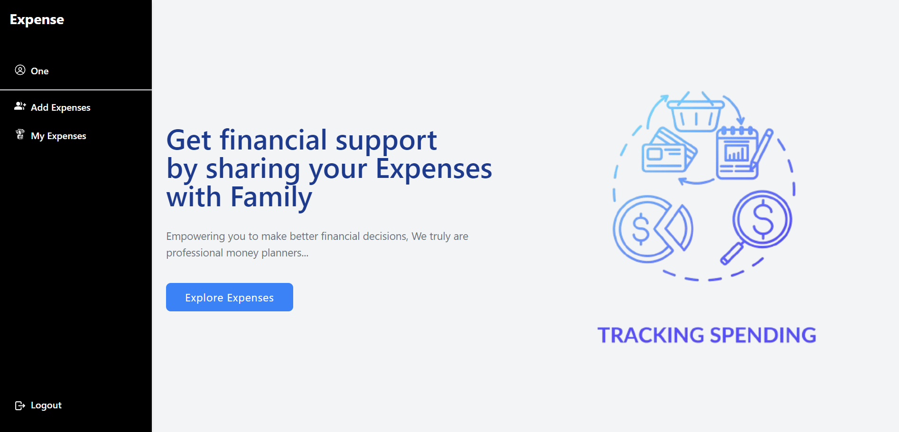

# Expense tracker

A MERN stack application for tracking and managing personal expenses. This user-friendly application allows individuals to create, update, and delete their expense records, providing insights into their spending habits.


## 🚀 Features

- **User Authentication**: Securely sign up and log in to your account.
- **Expense Management**: Easily add, update, or delete expense entries.
- **Member Collaboration**: Invite and manage members for group expenses.
- **Real-time Search**: Filter and search through users and expenses quickly.
- **Intuitive UI**: Designed with a clean and responsive interface using React and Tailwind CSS.

## Getting Started

To get started with the project, follow the instructions below:

1. Clone the repository:
   ```bash
   git clone https://github.com/yourusername/expense-tracker.git
2. Backend setup:
   ```bash
   cd backend
   npm install
   npm run start
3. Frontend setup
    ```bash
    cd client
    npm install
    npm run dev

## 🖼️ Screenshots


<p align="center">
  




</p>
